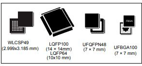
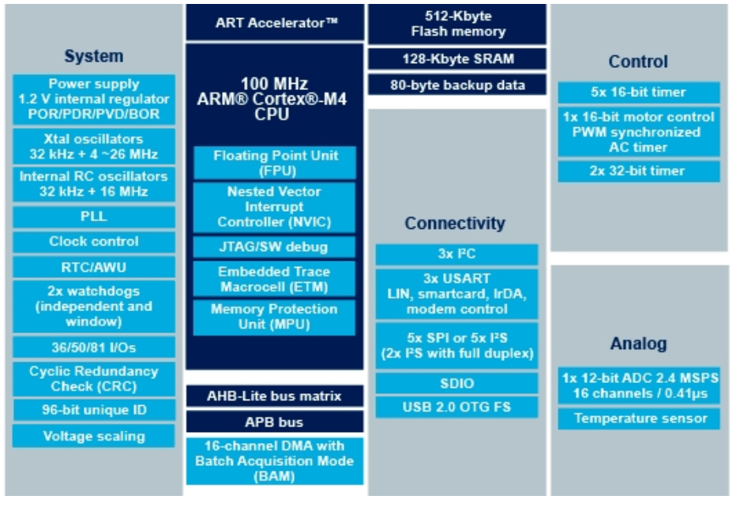

:imagesdir: Papka
== Исправление ответов на вопросы
==== Шумаков Е.М КЭ-413

==== 3. Что можно использовать, а лучше нужно вместо typedef?
Ключевое слово typedef в языке C++ позволяет создавать пользовательские типы данных – для этого достаточно определить новое имя типа данных для уже существующего типа данных. При этом сам новый тип данных не создается, а лишь определяется новое имя для уже существующего типа. Благодаря использованию пользовательских типов  можно делать программы более гибкими: для этого иногда достаточно изменить typedef-инструкции с помощью макросов подстановки (#define). Использование пользовательских типов позволяет также улучшить читабельность кода, поскольку для стандартных типов данных с помощью typedef можно использовать собственные описательные имена. Общий формат записи инструкции для создания пользовательского типа:

   typedef тип новое_имя;

Здесь элемент тип означает любой допустимый тип данных, а элемент новое_имя – новое имя для этого типа. Важно отметить, что новое имя определяется только в качестве дополнения к существующему имени типа, а не для его замены. В языке MQL5 с помощью typedef можно создавать указатели на функции.

*Указатель на функцию*

Указатель на функцию в общем виде определятся форматом записи

   typedef тип_результата_функции (*Имя_типа_функции)(список_типов_входных параметров);
   
Для того, чтобы было было понятнее работать с типом можно вводить их псевдонимы (alias). С помощью ключевого слова using ;

[source,]
----
auto t = std::make_tuple(10, "Test", 3.14, 2U);  # (1)
using tMytype = decltype(t) ;  # (2)
using tShortType = std::tuple<int, string, double, tU32> ; # (3)

void(tMyType & value) {    # (4)
  ...
}
int main() {
  using tU32 = unsigned int ;  # (5)
  tU32 i = 10U ;               # (6)

  myfunction(t) ;              # (7)
}
----
1. Определяем кортеж из 4 элементов разного типа
2. Объявляем псевдоним типа, который имеет кортеж (тип выводится компилятором)
3. Тоже самое что и <2> за исключением того, что указываем тип напрямую
4. Объявляем функцию, принимающую аргумент типа, который имеет кортеж
5. Объявляем псевдоним типа unsigned int
7. Определяем переменную типа unsigned int

==== 16. По какой архитектуре разработан ARM Cortex микроконтроллер?

В его основе лежит архитектура ARMv6-M. Основное отличие от классической «большой» ARMv6 заключается в использовании только набора 16-разрядных инструкций, под общим названием Thumb. Дополнительно поддерживаются некоторые команды более нового набора Thumb2. Такое решение, при незначительном падении вычислительной мощности, максимально упростило процессор относительно старших моделей и позволило использовать дешевую 16-ти разрядную память.

==== 18. Где располагаются локальные переменные?

Если не определено место для хранения локальных переменных, то они будут храниться в стеке. Тот факт, что стек является динамически изменяющейся областью памяти, объясняет, почему локальные переменные в общем не могут содержать значения между вызовами функций.

==== 20.Где располагаются глобальные переменные?

Глобальные переменные хранятся в фиксированной области памяти, устанавливаемой компилятором. Глобальные переменные чрезвычайно полезны, когда одни и те же данные используются в нескольких функциях программы. Следует избегать ненужного использования глобальных переменных по трем причинам:

Они используют память в течение всего времени работы программы, а не тогда, когда они необходимы.
Использование глобальных переменных вместо локальных приводит к тому, что функции становятся более частными, поскольку они зависят от переменных, определяемых снаружи.
Использование большого числа глобальных переменных может вызвать ошибки в программе из-за неизвестных и нежелательных эффектов.

==== 19.Где располагаются статические переменные?

C ++ статические переменные размещаются в глобальном пространстве памяти с глобальными переменными. Компилятор использует специальное соглашение об именах, чтобы знать, что эта переменная принадлежит классу.

==== 33. Объясните как вызывается функция

Вызов функции имеет вид имени функции с последующими круглыми скобками. Эти скобки могут быть пустыми, если функция не имеет аргументов. Если же аргументы в самой функции есть, их необходимо указать в круглых скобках.

Также существует такое понятие, как параметры функции по умолчанию. Такие параметры можно не указывать при вызове функции, т.к. они примут значение по умолчанию, указанно после знака присваивания после данного параметра и списке всех параметров функции.

Рассмотрим пример функции, возвращающей значение на примере проверки пароля.
[source,]
----
#include <iostream>
#include <string>

using namespace std;
string check_pass (string password)
{
    string valid_pass = "qwerty123";
    string error_message;
    if (password == valid_pass) {
        error_message = "Доступ разрешен.";
    } else {
        error_message = "Неверный пароль!";
    }
    return error_message;
}
int main()
{    
    string user_pass;
    cout << "Введите пароль: ";
    getline (cin, user_pass);
    string error_msg = check_pass (user_pass);
    cout << error_msg << endl;
    return 0;
}
----

В данном случае функция check_pass имеет тип string, следовательно она будет возвращать только значение типа string, иными словами говоря строку. Давайте рассмотрим алгоритм работы этой программы.

Самой первой выполняется функция main(), которая должна присутствовать в каждой программе. Теперь мы объявляем переменную user_pass типа string, затем выводим пользователю сообщение «Введите пароль», который после ввода попадает в строку user_pass. А вот дальше начинает работать наша собственная функция check_pass().

В качестве аргумента этой функции передается строка, введенная пользователем.

Аргумент функции — это, если сказать простым языком переменные или константы вызывающей функции, которые будет использовать вызываемая функция.

При объявлении функций создается формальный параметр, имя которого может отличаться от параметра, передаваемого при вызове этой функции. Но типы формальных параметров и передаваемых функии аргументов в большинстве случаев должны быть аналогичны.

После того, как произошел вызов функции check_pass(), начинает работать данная функция. Если функцию нигде не вызвать, то этот код будет проигнорирован программой. Итак, мы передали в качестве аргумента строку, которую ввел пользователь.

Теперь эта строка в полном распоряжении функции (хочу обратить Ваше внимание на то, что переменные и константы, объявленные в разных функциях независимы друг от друга, они даже могут иметь одинаковые имена. В следующих уроках я расскажу о том, что такое область видимости, локальные и глобальные переменные).

Теперь мы проверяем, правильный ли пароль ввел пользователь или нет. если пользователь ввел правильный пароль, присваиваем переменной error_message соответствующее значение. если нет, то сообщение об ошибке.

После этой проверки мы возвращаем переменную error_message. На этом работа нашей функции закончена. А теперь, в функции main(), то значение, которое возвратила наша функция мы присваиваем переменной error_msg и выводим это значение (строку) на экран терминала.

==== 36. Как лучше организовывать структуру проекта? 
1. Соблюдайте единый Code Style

* Названия макросов и макрофункций пишутся капсом, слова в названиях отделяются друг от друга нижним подчеркиванием.
* Названия переменных записываются в нижнем регистре, а слова в названиях отделяются нижним подчеркиванием
* Названия библиотечных функций общего пользования пишутся одним словом, иногда сокращенным, но это слово передает суть функции — что она должна делать.
* Специализированные функции (которые вызываются в пределах работы внутри какого-то специфичного контекста) лучше называть так, чтобы было определенно ясно, что делает эта функция.
* Соблюдайте однородность переноса скобок
* Объявляйте переменные в начале функции.
2. Оптимизируйте структуру вашего проекта
 
*  Называйте файлы так, чтобы всем было ясно, какой файл за что отвечает.
* Храните заголовочники в директории include
* Логически группируйте .c файлы в папки.

==== 43.Как сбросить бит с помощью битовых операторов?
[source,]
----
PORTD&=~(1<<0); //CБРОС БИТА С ПОМОЩЬЮ БИТОВЫХ ОПЕРАТОРОВ
----
==== 44. Как установить бит с помощью битовых операторов?
[source,]
----
PORTD∣=(1<<0)// УСТАНОВКА БИТА С ПОМОЩЬЮ БИТОВЫХ ОПЕРАТОРОВ
----
==== 45. Как поменять значение бита с помощью битовых операторов?
[source,]
----
PORTD^=(1<<0)// СМЕНА ЗНАЧЕНИЯ БИТА С ПОМОЩЬЮ БИТОВЫХ ОПЕРАТОРОВ
----

==== 46. Какой микроконтроллер на отладочной плате XNUCLE ST32F411?
Если я правильно понял суть, то там *Микроконтроллер STM32F411VET6, 512 KB Flash памяти, 128 KB RAM, корпус LQFP100?*

QFP (от англ. Quad Flat Package) — семейство корпусов микросхем, имеющих планарные выводы, расположенные по всем четырём сторонам. Микросхемы в таких корпусах предназначены только для поверхностного монтажа; установка в разъём или монтаж в отверстия штатно не предусмотрен, хотя переходные коммутационные устройства существуют. Количество выводов QFP микросхем обычно не превышает 200, с шагом от 0,4 до 1,0 мм.

Иначе говоря микроконтролер на 100 выводов 64 бита 

==== 47. Какие блоки входят в состав микроконтроллера STM32F411?

 
image::43388.JPG[] 

Такая же картинка на русском
Отличия STM32F411 от STM32F401:

1. Частота на 100 Мгц 
2.  У STM32F411 Отсутвуют таймеры 
3. У STM32F411 SRAM(ОЗУ) 128 кбайт 

*Остальное одинаковое !!!!*

====48. В чем отличие ядра CortexM4 от CortexM3?

ОТЛИЧИЕ В ТАБЛИЦЕ ВЫДЕЛЕННО ЖИРНЫМ  *ВОТ ТАКИМ*

ТАБЛИЦА СРАВНИТЕЛЬНАЯ!!!

.Сравнительная таблица 
[width="100%"]
|====================
| Параметр​ | ARM Cortex-M3​ |  ARM Cortex-M4​
|Архитектура​  | ARMv7 (Гарвардская)​ |  ARMv7 (Гарвардская)​
|Набор инструкций​| Thumb/Thumb-2​ |  Thumb/Thumb-2, DSP, SIMD, FP​
|Конвейер​ | 3 уровня + предсказание ветвлений​|  3 уровня + предсказание ветвлений​
|Прерывания​| NMI (немаскируемые) + от 1 до 240 физических источников прерываний​ |  NMI (немаскируемые) + от 1 до 240 физических источников прерываний​
|Длительность входа в обработчик прерывания​  | 12 циклов​ |  12 циклов​
|Длительность переключения между обработчиками прерываний​  |  6 циклов​| 6 циклов​ 
|Режимы пониженного энергопотребления​|Встроены​ | Встроены​ 
| Защита памяти | Блок защиты памяти с 8 областями​ |  Блок защиты памяти с 8 областями​
| Производительность по тесту Dhrystone​ | 1,25 DMIPS/МГц​ |  1,25 DMIPS/МГц​
| Энергопотребление ядра​ | 0,19 мВт/МГц​  |  0,19 мВт/МГц​
| *Аппаратный модуль работы с плавающей точкой* ​ | нет​  | **есть**​  
|====================

ВЫНЕСУ НА ВСЯКИЙ 

*Аппаратный модуль работы с плавающей точкой* 

ARM Cortex-M3 (нет) 

ARM Cortex-M4 (**есть**​)

