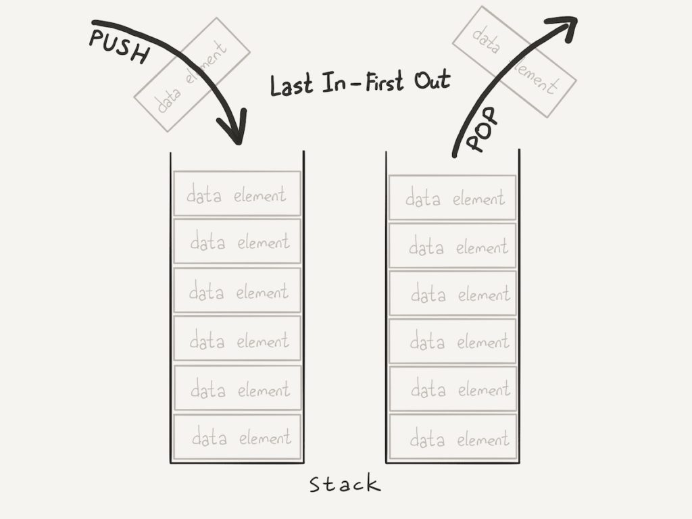
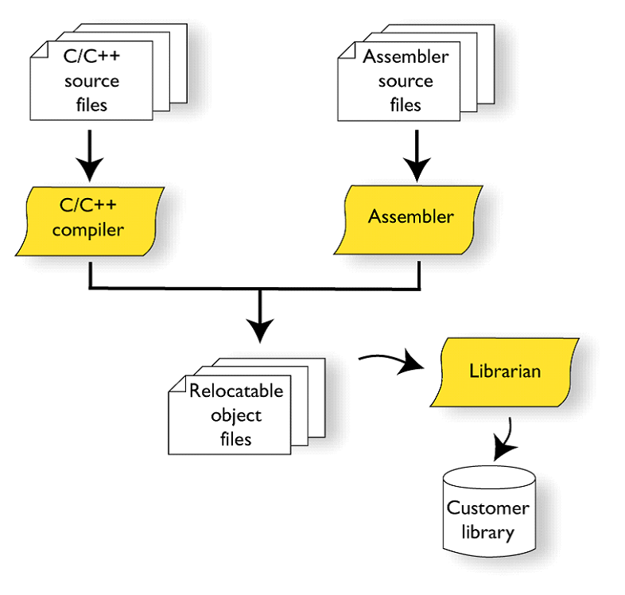
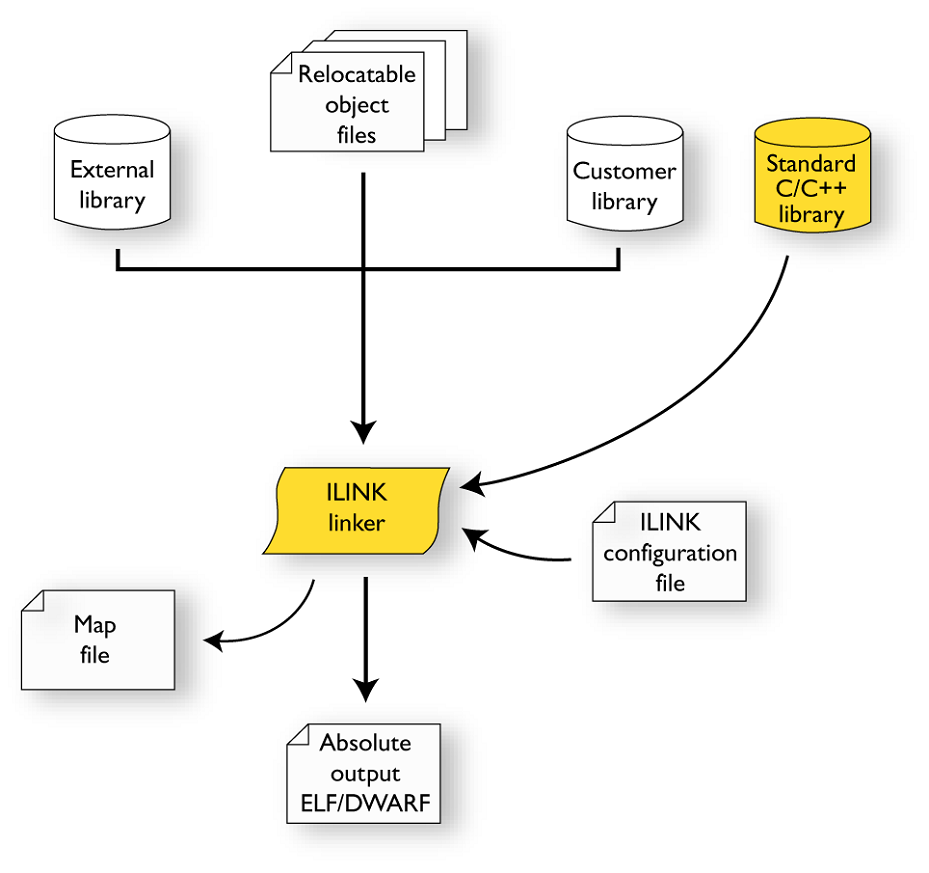
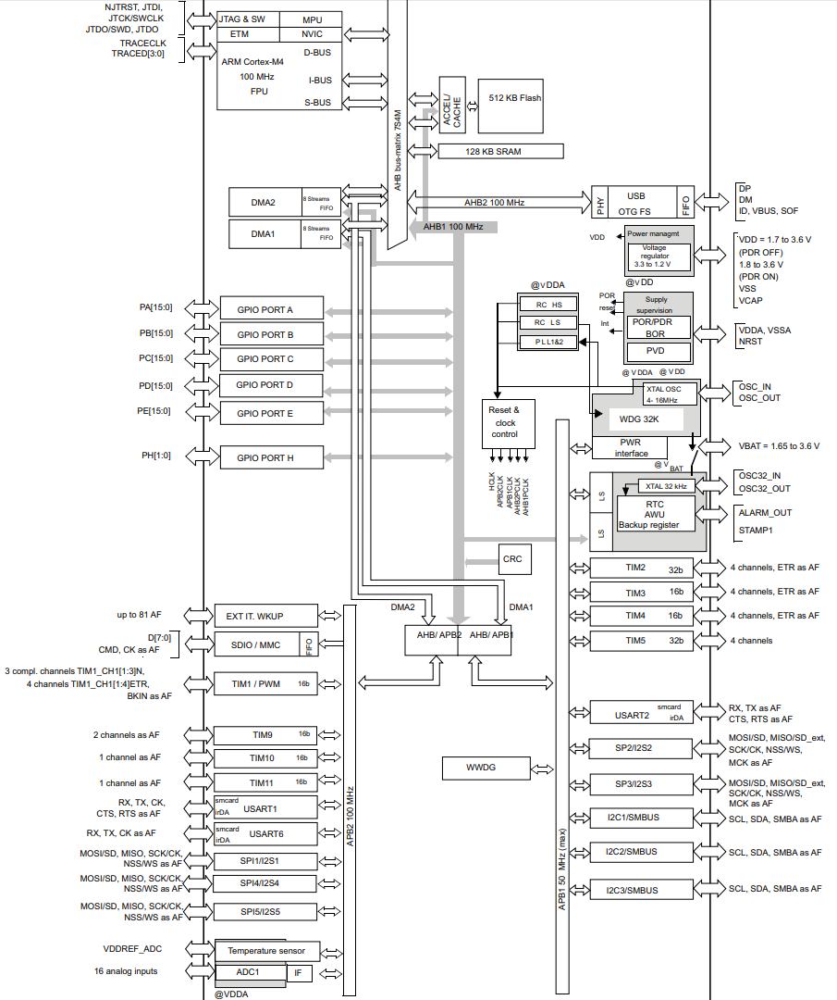

:imagesdir: Papka
== Ответы на контрольные вопросы. 
=== Выполнил: Шумаков Е.М.Группа: КЭ-413

==== 1.Что такое POD типы данных?
*Простая структура данных* (POD) — в современных языках программирования высокого уровня тип данных, имеющий жёстко определённое расположение полей в памяти, не требующий ограничения доступа и автоматического управления. 
Переменные такого типа можно копировать простыми процедурами копирования участков памяти наподобие memcpy. 
Противоположность — управляемая структура данных.

Проще всего простую структуру данных определить от противного. Если компилятор скрытно от пользователя переставил поля местами, или при создании структуры данных скрытно вызывает конструктор, или при уничтожении структуры вызывает деструктор, или при копировании — особую процедуру копирования, то это управляемая (то есть не простая) структура.

==== 2.Назовите все типы данных в языке С++
Основные типы данных:

* int (целый);
* char (символьный);
* bool (логический);
* float (вещественный);
* double (вещественный с двойной точностью).

Для уточнения диапазона значений и внутреннего представления стандартных типов применяются четыре спецификатора типа:

* short (короткий);
* long (длинный);
* signed (знаковый);
* unsigned (беззнаковый).

К основным типам языка С++ относится также тип void. Множество значений этого типа пусто. Он применяется для определения функций, которые не возвращают значения, для указания пустого списка аргументов функции, как базовый тип для указателей и в операции приведения типов.

==== 3.Что такое пользовательский тип? 
Ключевое слово typedef в языке C++ позволяет создавать пользовательские типы данных – для этого достаточно определить новое имя типа данных для уже существующего типа данных. При этом сам новый тип данных не создается, а лишь определяется новое имя для уже существующего типа. Благодаря использованию пользовательских типов  можно делать программы более гибкими: для этого иногда достаточно изменить typedef-инструкции с помощью макросов подстановки (#define). Использование пользовательских типов позволяет также улучшить читабельность кода, поскольку для стандартных типов данных с помощью typedef можно использовать собственные описательные имена. Общий формат записи инструкции для создания пользовательского типа:

   typedef тип новое_имя;

Здесь элемент тип означает любой допустимый тип данных, а элемент новое_имя – новое имя для этого типа. Важно отметить, что новое имя определяется только в качестве дополнения к существующему имени типа, а не для его замены. В языке MQL5 с помощью typedef можно создавать указатели на функции.

*Указатель на функцию*

Указатель на функцию в общем виде определятся форматом записи

   typedef тип_результата_функции (*Имя_типа_функции)(список_типов_входных параметров);

==== 4.Назовите модификаторы типов

cписок модификаторов:

* signed
* unsigned
* short

Модификаторы **signed, unsigned**,** long** и *short* могут применяться к целочисленным типам. К символам можно применять signed и unsigned, long может применяться к типу **double**.

==== 5. Назовите правило установки размеров типов

Размеры типов не четко определены и могут отличаться для различных микроконтроллеров. Для размеров типов существует правило:

[source,]
----
1             <= sizeof(char)     <= sizeof() <= sizeof(short) <= sizeof(int) <= sizeof(long)
1             <= sizeof(bool)     <= sizeof(long)
sizeof(char)  <= sizeof(long)
sizeof(float) <= sizeof(double)   <= sizeof(long double)
sizeof(T)     == sizeof(signed T) == sizeof(unsigned T)

----

Поэтому вместо прямых типов типа int, используйте псевдонимы, например:

.Размеры Типов
[width="100%"]
|====================
| std::uint32_t | целое беззнаковое длиной 32 бита 
| std::int64_t |  целое знаковое длинной 64 бита
| std::uint8_t |  целое знаковое длинной 8 бит
|====================

==== 6. Что делает оператор sizeof()?
sizeof - это унарный оператор, возвращающий длину в байтах переменной или типа, помещенных в скобки. Например:
[source,]
----
sizeof ( type name );
sizeof ( object );
sizeof object;
----
* Применение sizeof к массиву дает количество байтов, занимаемых массивом, а не количество его элементов и не размер в байтах каждого из них.
* Применение sizeof к указателю дает размер самого указателя, а не объекта, на который он указывает

==== 7. Что характеризует тип std::size_t?
Результат применения типа sizeof  имеет специальный тип size_t, который определен как typedef в заголовочном файле cstddef. 

Вот пример использования обеих форм оператора sizeof:
[source,]
----
#include cstddef
int ia[] = { 0, 1, 2 };
// sizeof возвращает размер всего массива
size_t array_size = sizeof ia;
// sizeof возвращает размер типа int
size_t element_size = array_size / sizeof( int );
----

==== 8. Назовите фиксированные типы целых в библиотеке std

.Типы целых в библиотеке std 
[width="100%",options="header"]
|====================
|  Название| Тип  | Диапазон значений 
| int8_t  | 1 байт signed |от -128 до 127  
| uint8_t | 1 байт unsigned|от 0 до 255 
| int16_t | 2 байта signed |от -32 768 до 32 767
| int16_t | 2 байта unsigned |от 0 до 65 535  
| int32_t | 4 байта signed |от -2 147 483 648 до 2 147 483 647
| uint32_t| 4 байта unsigned|от 0 до 4 294 967 295  
| int64_t | 8 байт signed| от -9 223 372 036 854 775 808 до 
9 223 372 036 854 775 807 
| uint64_t| 8 байт unsigned | от 0 до 18 446 744 073 709 551 615
|====================
Доступ к этим типам осуществляется через подключение заголовочного файла cstdint (находятся эти типы данных в пространстве имён std).
[source,]
----
#include <iostream>
#include <cstdint>
int main()
{
    std::int16_t i(5); // прямая инициализация
    std::cout << i << std::endl;
    return 0;
}
----
==== 9.Что такое псевдоним типа?
Объявление псевдонима типа вводит имя, которое может использоваться в качестве синонима типа.Оно не вводит новый тип и не может изменить значение существующего имени типа. Между псевдонимом типа и объявлением *typedef* нет никакой разницы.

Ключевое слово *typedef* позволяет программисту создать псевдоним для любого типа данных и использовать его вместо фактического имени типа. 

Чтобы объявить *typedef* (использовать псевдоним типа) — используйте ключевое слово typedef + тип данных, для которого создаётся псевдоним, а затем, собственно, сам псевдоним.

==== 10. Что такое явное и неявное преобразование типа?

Преобразование значения переменной одного типа в значение другого типа называется приведение типа (через букву "е") и бывает явным и неявным:

* При явном приведении перед выражением следует указать в круглых скобках имя типа, к которому необходимо преобразовать исходное значение.
* При неявном приведении преобразование происходит автоматически, по правилам, заложенным в языке Си.

*Неявное преобразование типов*

Базовые/простые типы неявно можно привести друг к другу. Т.е:
[source,]
----
int a = 0; 
char a = 512; 
int a = 3.14;  
bool a = -4; 
bool a  = 0;  
----
* Присваимаем знаковое целое(int) число переменной целого типа;
* Присваиваем знаковое целое(int) число переменной типа char. Результат а=0 ;
* Присваиваем число с плавающей точкой(double) к переменной типа int. Результат а=3;
* Присваиваем знаковое целое(int) к переменной типа bool. Результат true;
* Присваиваем знаковое целое(int) к переменной типа bool. Результат false.

*Явное преобразование типов*
[source,]
----
int x = 5;
double y = 15.3;
x = (int) y;
y = (double) x;
----
==== 11.Какие явные преобразования типов вы знаете?
Для преобразований из одного типа используют 4 вариантов преобразования:

* static_cast
* const_cast
* reinterpret_cast
* dynamic_cast

*static_cast*

static_cast позволяет сделать приведение близких типов (целые, пользовательских типов которые могут создаваться из типов который приводится, и указатель на void* к указателю на любой тип).
Проверка производится на уровне компиляции, так что в случае ошибки сообщение будет получено в момент сборки приложения или библиотеки.
[source,]
----
int a = static_cast<int>(0); 
int a = static_cast<int>(3.14);  
bool a = static_cast<bool>(-4);  
bool a  = static_cast<bool>(0);  
float f = 3.14f ;    
float f = static_cast<float>(3.14) ;  
Complex f = static_cast<3.14> 
----
* Явно говорим, что 0 должен восприниматься как тип (int), хотя он и так является литералом типа int. Но все ли помнят об этом?
* Явно говорим, что 3.14 воспринимать как int, т.е взять только целую часть.
* Явно говорим, -4 нужно воспринять как bool тип, в данном случае true.
* Явно говорим, 0 нужно воспринять как bool тип, в данном случае false.
* Явно говорим, что 3.14 это float
* Явно говорим, что 3.14 это float

Комплексное число может создаться из **double**, поэтому тут будет работать static_cast.

==== 12 Что делает reinterpret_cast?

*reinterpret_cast*

reinterpret_cast преобразует типы, несовместимыми друг с другом, и используется для:

* В свой собственный тип
* Указателя в интегральный тип
* Интегрального типа в указатель
* Указателя одного типа в указатель другого типа
* Указателя на функцию одного типа в указатель на функцию другого типа[source,]
----
auto ptr = reinterpret_cast<volatile uint32_t *>(0x40010000) ; # (1)
auto value = *ptr ; #(2)
----
1. Преобразует адрес 0x40010000 в указатель типа volatile uint32_t
2. Записывает в переменную value (типа) значение лежащее по указателю ptr, указывающего на адрес 0x40010000

==== 13. Чем static_cast отличается от reinterpret_cast?

static_cast позволяет сделать *приведение близких типов* (целые, пользовательских типов которые могут создаваться из типов который приводится, и указатель на void* к указателю на любой тип).

reinterpret_cast преобразует типы, *несовместимыми друг с другом*

==== 14. Что такое ОЗУ и ПЗУ? 
**Оперативная память или ОЗУ**- часть системы компьютерной памяти, в которой во время работы компьютера хранится выполняемый машинный код (программы), а также входные, выходные и промежуточные данные, обрабатываемые процессором.

*Постоянное запоминающее устройство или ПЗУ* — энергонезависимая память, используется для хранения массива неизменяемых данных.

==== 15.Каков размер памяти ARM Cortex микроконтроллеров? 

Ядро ARM имеет 4 Гбайт последовательной памяти с адресов 0x00000000 до 0xFFFFFFFF.

Различные типы памяти могут быть расположены по эти адресам. Обычно микроконтроллер имеет постоянную память, из которой можно только читать (ПЗУ) и оперативную память, из которой можно читать и в которую можно писать (ОЗУ).

Также часть адресов этой памяти отведены под регистры управления и регистры периферии

==== 16. По какой архитектуре разработан ARM Cortex микроконтроллер?

Cortex-M3 выполнено по Гарвардской архитектуре и, поэтому, имеет несколько шин, позволяющие выполнять операции параллельно.

==== 17. В чем отличие Гарвардской архитектуры от Архитектура ФонНеймана?

Гарвардская архитектура — архитектура ЭВМ, отличительными признаками которой являются:

 * хранилище инструкций и хранилище данных представляют собой разные физические устройства;
 * канал инструкций и канал данных также физически разделены.
 *Отличие от архитектуры ФонНеймана*
 
В чистой архитектуре фон Неймана процессор в каждый момент времени может либо читать инструкцию, либо читать/записывать единицу данных из/в памяти. Оба действия одновременно происходить не могут, поскольку инструкции и данные используют один и тот же поток (шину).

В компьютере с использованием гарвардской архитектуры процессор может считывать очередную команду и оперировать памятью данных одновременно и без использования кэш-памяти. Таким образом, компьютер с гарвардской архитектурой при определенной сложности схемы быстрее, чем компьютер с архитектурой фон Неймана, поскольку потоки команд и данных расположены на раздельных физически не связанных между собой аппаратных каналах.

Исходя из физического разделения шин команд и данных, разрядности этих шин могут различаться и физически не могут пересекаться.

==== 18. Где располагаются локальные переменные?
Переменная, объявленная внутри какой-либо функции, является локальной. Область видимости локальной переменной ограничена пределами функции, внутри которой она объявлена. Локальная переменная может быть проинициализирована при помощи любого выражения. Инициализация локальной переменной производится каждый раз при вызове соответствующей функции. Локальные переменные располагаются во временной области памяти соответствующей функции.
Пример:
[source,]
----
int somefunc()
  {
   int ret_code=0;
   ...
   return(ret_code);
  }
----
==== 19.Где располагаются статические переменные?
Класс памяти static определяет статическую переменную. Модификатор static указывается перед типом данных.
Пример:
[source,]
----
int somefunc()
  {
   static int flag=10;
   ...
   return(flag);
  }
----
Статическая переменная может быть проинициализирована соответствующей ее типу константой или константным выражением, в отличие от простой локальной переменной, которая может быть проинициализирована любым выражением.

Область их видимости - локальна, в пределах блока, в котором они объявлены.
Локальные переменные, объявленные с ключевым словом static, сохраняют свои значения в течение всего времени существования функции. При каждом следующем вызове функции такие локальные переменные содержат те значения, которые они имели при предыдущем вызове.

==== 20.Где располагаются глобальные переменные?

Глобальные переменные создаются путем размещения их объявлений вне описания какой-либо функции. Глобальные переменные определяются на том же уровне, что и функции, т. е. не локальны ни в каком блоке.
Область видимости глобальных переменных - вся программа, глобальные переменные доступны из всех функций, определенных в программе. Инициализируются нулем, если явно не задано другое начальное значение. Глобальная переменная может быть проинициализирована только соответствующей ее типу константой либо константным выражением.

==== 21. Что такое стек?
Стек (stack) является структурой данных.Дисциплина работы стека обозначается LIFO, последним пришел — первым ушел (Last In First Out).Стек можно реализовать при помощи массива.

Стек поддерживает две основные операции:

* добавление элемента в вершину стека (push);
* удаление элемента из вершины стека (pop);
Стек можно представить себе как стопку дисков,на которую сверху можно класть диски,и брать их можно тоже только сверху.

==== 22.Что такое указатель?

К переменной можно обратиться непосредственно обращаясь к самой переменной, тогда мы можем напрямую писать или читать значение с адреса переменной, либо можно обратиться косвенно, через указатель или ссылку.

Указатель это переменная, которая хранит адрес какой-то другой переменной:
[source,]
----
int main() {
  int  c = 463 ;  
  int* ptr = &c ;  
  return 0;
}
----
* Объявляем переменную c типа int
* объявляем указатель ptr на переменную c типа int

==== 23. Что такое разыменовывание указателя?

Как только у нас есть указатель, указывающий на что-либо, мы можем его разыменовать, чтобы получить значение, на которое он указывает. Разыменованный указатель — это содержимое ячейки памяти, на которую он указывает:
[source,]
----
#include <iostream>
int main()
{
	int value = 5;
	std::cout << &value << std::endl; // выводим адрес value
	std::cout << value << std::endl; // выводим содержимое value
 
	int *ptr = &value; // ptr указывает на value
	std::cout << ptr << std::endl; // выводим адрес, который хранится в ptr, т.е. &value
	std::cout << *ptr << std::endl; // разыменовываем ptr (получаем значение на которое указывает ptr)
	return 0;
}
----
Результат:

* 0034FD90
* 5
* 0034FD90
* 5

==== 24. Что означает взятие адреса?

Указатель - это адрес переменной в памяти. Указатель на переменную - это переменная, специально созданная для хранения указателя на объект определенного типа. Зная адрес переменной, можно существенно упростить работу некоторых программ. Указатели имеют три главных назначения в С:

* Предоставляют быстрое обращение к элементам массива.
* Позволяют функциям модифицировать передаваемые параметры.
* Поддерживают динамические структуры данных, например списки.

Оператор &. Это унарный оператор, возвращающий адрес операнда в памяти. (Унарному оператору требуется только один операнд.) Например:
[source,]
----
m = &count;
----

помещает в m адрес переменной count. Это адрес внутреннего местоположения переменной в компьютере. С самим значением переменной ничего не делается. Оператор & можно запомнить как «взятие адреса». Поэтому вышеупомянутый оператор присваивания можно прочитать *как «m получает адрес count».*

==== 25. Какие операции можно выполнять над указателями?

К указателям могут применяться только две арифметические операции: сложение и вычитание. Для понимания арифметических действий с указателями предположим, что p1 - это указатель на целое, содержащий значение 2000, и будем считать, что целые имеют длину 2 байта. После выражения

p1 ++;

содержимое p1 станет 2002, а не 2001! Каждый раз при увеличении p1 указатель будет указывать на следующее целое. Это справедливо и для уменьшения. Например:

р1 --;

приведет к тому, что p1 получит значение 1998, если считать, что раньше было 2000.

Естественно, все не ограничивается только уменьшением или увеличением. Можно добавлять или вычитать из указателей целые числа. Выражение

p1 = p1 + 9;

приводит к тому, что указатель p1 указывает на девятый элемент по сравнению с элементом, на который он указывал до присваивания.

Помимо добавления или вычитания указателей и целых чисел, единственную операцию, которую можно выполнять с указателями, - это вычитание одного указателя из другого.

==== 26. Что такое константный указатель?
Константный указатель — это указатель, значение которого не может быть изменено после инициализации. Для объявления константного указателя используется ключевое **слово const между звёздочкой и именем указателя**:
[source,]
----
int value = 7;
int *const ptr = &value;
----

==== 27.Что такое указатель на константу?

*Указатель на константное значение* — это неконстантный указатель, который указывает на неизменное значение. Для объявления указателя на константное значение, используется ключевое слово *const* перед типом данных.
[source,]
----
const int value = 7;
const int *ptr = &value; // здесь всё ок: ptr - это неконстантный указатель, который указывает на "const int"
*ptr = 8; // нельзя, мы не можем изменить константное значение
----

==== 28. Что такое ссылка? В чем её отличие от указателя?
Ссылка в программировании — это объект, указывающий на определенные данные, но не хранящий их. Получение объекта по ссылке называется разыменованием.

Ссылка не является указателем, а просто является другим именем для объекта. Главное отличие ссылки от указателей: указатель это целое число, для ссылки доступны только 2 операции: копирование и разыменование.

*Отличия*

1. Указатель может быть переназначен любое количество раз, в то время как ссылка после привязки не может быть перемещена на другую ячейку памяти.

2. Указатели могут указывать "в никуда" (быть равными NULL), в то время как ссылка всегда указывает на определенный объект. GCC может без выдачи предупреждений обработать код наподобие int &x = *(int*)0;, однако поведение подобного кода может быть непредсказуемым.

3. Вы не можете получить адрес ссылки, как можете это делать с указателями.

4. Не существует арифметики ссылок, в то время как существует арифметика указателей. Однако есть возможность получить адрес объекта, указанного по ссылке, и применить к этому адресу арифметику указателей.

==== 29. Что такое регистр?
Регистр - это определенный участок памяти внутри самого процессора, от 8-ми до 32-х бит длиной, который используется для промежуточного хранения информации, обрабатываемой процессором. Некоторые регистры содержат только определенную информацию.

==== 30. Что такое регистры общего назначения?

Регистры общего назначения предназначены для хранения операндов арифметико-логических инструкций, а также адресов или отдельных компонентов адресов ячеек памяти.

С точки зрения прикладного программиста, процессор располагает 16-ю 32-разрядными регистрами общего назначения (РОН, GPR), из которых три на деле имеют специальные функции:

* Оперативные регистры
* Вспомогательные регистры
* Специальные регистры

==== 31.Что такое регистры специального назначения?
Так как регистр специального назначения - это просто адресуемая ячейка памяти, то  мы можем обратиться к данным по этому адресу, разыменовывая указатель, указывающий на этот адрес.

==== 32. Как можно установить бит в регистре специального назначения?
[source,]
----
int main()
{
  *reinterpret_cast<uint32_t *>(0x40010000) |= 1 << 0 ; # (1)
  TIM1::CR1::CEN::Enable::Set() ;                       # (2)
}
----
1. Записываем 1 в нулевой бит ячейки памяти (регистра) по адресу 0x40010000

2. Тоже самое, но с использование специального класса на С++

==== 33. Объясните как вызывается функция.

Вызов функции имеет вид имени функции с последующими круглыми скобками. Эти скобки могут быть пустыми, если функция не имеет аргументов. Если же аргументы в самой функции есть, их необходимо указать в круглых скобках.

Также существует такое понятие, как параметры функции по умолчанию. Такие параметры можно не указывать при вызове функции, т.к. они примут значение по умолчанию, указанно после знака присваивания после данного параметра и списке всех параметров функции.
[source,]
----
#include <iostream>     
using namespace std;

void function_name ()
{
    cout << "Hello, world" << endl;
}
int main()
{
    function_name(); // Вызов функции
    return 0;
}
----
 
Если мы хотим вывести «Hello, world» где-то еще, нам просто нужно вызвать соответствующую функцию. В данном случае это делается так: function_name();
 
 
==== 34. Что такое трансляция?
Трансляцию кода выполняет компилятор. Структурно процесс трансляции с помощью компилятора показан на рисунке [Схема Трансляции]. После трансляции вы можете получить на выходе либо файлы библиотеки, которые впоследствии можно будет использовать в других проектах, либо объектные файлы.

==== 35. Что такое компоновка?

Компоновщик — инструментальная программа, которая производит компоновку («линковку»): принимает на вход один или несколько объектных модулей и собирает по ним исполнимый модуль.

Компоновщик может извлекать объектные файлы из специальных коллекций, называемых библиотеками. Если не все символы, на которые ссылаются пользовательские объектные файлы, определены, то компоновщик ищет их определения в библиотеках, которые пользователь подал ему на вход. Обычно, одна или несколько системных библиотек используются компоновщиком по умолчанию. Когда объектный файл, в котором содержится определение какого-либо искомого символа, найден, компоновщик может включить его (файл) в исполнимый модуль (в случае статической компоновки) или отложить это до момента запуска программы (в случае динамической компоновки).

==== 36. Как лучше организовывать структуру проекта и почему?

==== 37. Что такое операторы?

Операторы-наименьшая автономная часть языка программирования; команда или набор команд. Программа обычно представляет собой последовательность инструкций.

==== 38. Какие арифметические операторы вы знаете?

.Арифметические операторы 
[width="100%",options="header,footer"]
|====================
| Оператор |  Описание
|  + (сложение)|складывает два числа.  
|  / (деление)| Делит одно число на другое. 
|  * (умножение)|Перемножает два числа.  
| - (вычитание) |  Выполняет вычитание двух чисел.
| ^ (возведение в степень) |Возводит одно число в степень, указанную другим числом.  
|====================

==== 39. Какие логические операторы вы знаете?
Логические операторы предоставляют действия над булевым типов. Результат действия этих операторов может быть только *true* или *false*

.Логические операторы 
[width="100%",options="header,footer"]
|====================
| Операция |Оператор  |Комментарий  |Пример  
| Логическое отрицание, НЕ | ! | !true ⇒ false |  
| Логическое умножение, И  | &&| true && false ⇒ false |  
| Логическое сложение, ИЛИ |  ∣∣   | 	
true ∣∣ false ⇒ true |  
|====================

==== 40. Какие побитовые операторы вы знаете?

Побитовые операции — операции, производимые над цепочками битов. Выделяют два типа побитовых операций: логические операции и побитовые сдвиги.

* Битовые операторы И (AND, &)
* ИЛИ (OR, ∣)
* НЕ (NOT, ∼)

Побитовое ИЛИ используется для включения битов. Любой бит, установленный в 1, вызывает установку соответствующего бита результата также в 1.

Побитовое И используется для выключения битов. Любой бит, установленный в 0, вызывает установку соответствующего бита результата также в 0

Побитовое НЕ инвертирует состояние каждого бита исходной переменной.

==== 41. Приведите пример переопределения оператора

Синтаксис перегрузки операторов очень похож на определение функции с именем operator@, где @ — это идентификатор оператора (например +, -, <<, >>). Рассмотрим  пример:
[source,]
----
class Integer
{
private:
    int value;
public:
    Integer(int i): value(i) 
    {}
    const Integer operator+(const Integer& rv) const {
        return (value + rv.value);
    }
};
----
В данном случае, оператор оформлен как член класса, аргумент определяет значение, находящееся в правой части оператора. Вообще, существует два основных способа перегрузки операторов: глобальные функции, дружественные для класса, или подставляемые функции самого класса. Какой способ, для какого оператора лучше, рассмотрим в конце топика.

В большинстве случаев, операторы (кроме условных) возвращают объект, или ссылку на тип, к которому относятся его аргументы (если типы разные, то вы сами решаете как интерпретировать результат вычисления оператора).

*Перегрузка унарных операторов*

Рассмотрим примеры перегрузки унарных операторов для определенного выше класса Integer. Заодно определим их в виде дружественных функций и рассмотрим операторы декремента и инкремента:
[source,]
----
class Integer
{
private:
    int value;
public:
    Integer(int i): value(i) 
    {}

    //унарный +
    friend const Integer& operator+(const Integer& i);
    //унарный -
    friend const Integer operator-(const Integer& i);
    //префиксный инкремент
    friend const Integer& operator++(Integer& i);
    //постфиксный инкремент
    friend const Integer operator++(Integer& i, int);
    //префиксный декремент
    friend const Integer& operator--(Integer& i);
    //постфиксный декремент
    friend const Integer operator--(Integer& i, int);
};

//унарный плюс ничего не делает.
const Integer& operator+(const Integer& i) {
    return i.value;
}
const Integer operator-(const Integer& i) {
    return Integer(-i.value);
}
//префиксная версия возвращает значение после инкремента
const Integer& operator++(Integer& i) {
    i.value++;
    return i;
}

//постфиксная версия возвращает значение до инкремента
const Integer operator++(Integer& i, int) {
    Integer oldValue(i.value);
    i.value++;
    return oldValue;
}
//префиксная версия возвращает значение после декремента
const Integer& operator--(Integer& i) {
    i.value--;
    return i;
}
//постфиксная версия возвращает значение до декремента
const Integer operator--(Integer& i, int) {
    Integer oldValue(i.value);
    i.value--;
   return oldValue;
}
----

==== 42. Какие еще операторы вы знаете?

*Побитовые операторы*

.Побитовые Операторы
[width="100%",options="header,footer"]
|====================
| Операция |  Оператор| Комментарий | Пример | 
|Побитовая инверсия| ~ |~a  | unsigned char a = 0; ~a ⇒ 0xFF| 
|Побитовое И        |&| a&b|unsigned char a = 1, b = 3; a & b ⇒1|
|Побитовое ИЛИ | ∣ | a ∣ b |unsigned char a = 1, b = 3; a | b ⇒3 |  
|Побитовое исключающее ИЛИ| ^ | a^b |unsigned char a = 1, b = 3; a ^ b ⇒ 2|  
| Побитовый сдвиг влево |	<<  | a << b | unsigned char a = 1, b = 3; a << b ⇒ 8| 
| Побитовый сдвиг вправо| 	>> | a >> b | unsigned char a = 8, b = 3; a >> b ⇒ 1|
|====================

==== 43.Как сбросить бит с помощью битовых операторов?

[source,]
----
BIT&=~(1<<0); //CБРОС БИТА С ПОМОЩЬЮ БИТОВЫХ ОПЕРАТОРОВ
----

==== 44. Как установить бит с помощью битовых операторов?

[source,]
----
BIT∣=(1<<0)// УСТАНОВКА БИТА С ПОМОЩЬЮ БИТОВЫХ ОПЕРАТОРОВ 
----
==== 45. Как поменять значение бита с помощью битовых операторов?
[source,]
----
BIT^=(1<<0)// СМЕНА ЗНАЧЕНИЯ БИТА С ПОМОЩЬЮ БИТОВЫХ ОПЕРАТОРОВ
----

==== 46. Какой микроконтроллер на отладочной плате XNUCLE ST32F411?

image::Микроконтроллеры.JPG[]

В основе LQFP100 (LQFP64)

==== 47. Какие блоки входят в состав микроконтроллера STM32F411?

*Блок схема микроконтроллера*

==== 48. В чем отличие ядра CortexM4 от CortexM3?

.Сравнительная таблица 
[width="100%"]
|====================
| Параметр​ | ARM Cortex-M3​ |  ARM Cortex-M4​
|Архитектура​  | ARMv7 (Гарвардская)​ |  ARMv7 (Гарвардская)​
|Набор инструкций​| Thumb/Thumb-2​ |  Thumb/Thumb-2, DSP, SIMD, FP​
|Конвейер​ | 3 уровня + предсказание ветвлений​|  3 уровня + предсказание ветвлений​
|Прерывания​| NMI (немаскируемые) + от 1 до 240 физических источников прерываний​ |  NMI (немаскируемые) + от 1 до 240 физических источников прерываний​
|Длительность входа в обработчик прерывания​  | 12 циклов​ |  12 циклов​
|Длительность переключения между обработчиками прерываний​  |  6 циклов​| 6 циклов​ 
|Режимы пониженного энергопотребления​|Встроены​ | Встроены​ 
| Защита памяти | Блок защиты памяти с 8 областями​ |  Блок защиты памяти с 8 областями​
| Производительность по тесту Dhrystone​ | 1,25 DMIPS/МГц​ |  1,25 DMIPS/МГц​
| Энергопотребление ядра​ | 0,19 мВт/МГц​  |  0,19 мВт/МГц​
| *Аппаратный модуль работы с плавающей точкой* ​ | нет​  | **есть**​  
|====================

==== 49. Назовите основные характеристики микроконтроллера STM32F411.
икроконтроллер имеет следующие характеристики:

* 32 разрядное ядро ARM Cortex-M4
* Блок работы с числами с плавающей точкой FPU
* 512 кБайт памяти программ
* 128 кБайт ОЗУ
* Встроенный 12 битный 16 канальный АЦП
* DMA контроллер на 16 каналов
* USB 2.0
* 3x USART
* 5 x SPI/I2S
* 3x I2C
* SDIO интерфейс для карт SD/MMC/eMMC
* Аппаратный подсчет контрольной суммы памяти программ CRC
* 6 - 16 разрядных и 2 - 32 разрядных Таймера
* 1 - 16 битный для управления двигателями
* 2 сторожевых таймера
* 1 системный таймер
* Работа на частотах до 100Мгц
* 81 портов ввода вывода
* Питание от 1.7 до 3.6 Вольт
* Потребление 100 мкА/Мгц

==== 50.Назовите дополнительные характеристики микроконтроллера STM32F411.

Дополнительные особенности микроконтроллера
Из дополнительных особенностей, которые понадобятся для лабораторных работ следует выделить:

* Настраиваемые источники тактовой частоты
* Настраиваемые на различные функции порты
* Внутренний температурный сенсор
* Таймеры с настраиваемым модулем ШИМ
* DMA для работы с модулями (SPI, UART, ADC… )
* 12 разрядный ADC последовательного приближения
* Часы реального времени
* Системный таймер и спец. прерывания для облегчения и ускорения работы ОСРВ

==== 51. Какие источники тактирования есть у микроконтроллера STM32F411.

Модуль тактирования.
Модуль тактирования (Reset and Clock Control) RCC

Для формирования системной тактовой частоты SYSCLK могут использоваться 4 основных источника:​

1. HSI (high-speed internal) — внутренний высокочастотный RC-генератор.​

2. HSE (high-speed external) — внешний высокочастотный генератор.​

3. PLL — система ФАПЧ. Точнее сказать, это вовсе и не генератор, а набор из умножителей и делителей, исходный сигнал он получает от HSI или HSE, а на выходе у него уже другая частота.​

Также имеются 2 вторичных источника тактового сигнала:​

4. LSI (low-speed internal) — низкочастотный внутренний RC-генератор на 37 кГц​

5. LSE (low-speed external) — низкочастотный внешний источник на 32,768 кГц​

==== 52. Назовите алгоритм подключения системной частоты к источнику тактирования микроконтроллера STM32F411.

Алгоритм настройки частоты​
1.Определить какие источники частоты нужны​
2. Включить нужный источник​
3. Дождаться стабилизации источника ​
4. Назначить нужный источник на системную частоту​
5. Дождаться пока источник не переключиться на системную частоту​

==== 53. Что такое ФАПЧ?
Фа́зовая автоподстро́йка частоты (ФАПЧ, англ. PLL ) — система автоматического регулирования, подстраивающая фазу управляемого генератора так, чтобы она была равна фазе опорного сигнала, либо отличалась на известную функцию от времени. Регулировка осуществляется благодаря наличию отрицательной обратной связи. Выходной сигнал управляемого генератора сравнивается на фазовом детекторе с опорным сигналом, результат сравнения используется для подстройки управляемого генератора.

Система ФАПЧ используется для частотной модуляции и демодуляции, умножения и преобразования частоты, частотной фильтрации, выделения опорного колебания для когерентного детектирования и в других целях.

ФАПЧ сравнивает фазы входного и опорного сигналов и выводит сигнал ошибки, соответствующий разности между этими фазами. Сигнал ошибки проходит далее через фильтр низких частот и используется в качестве управляющего для генератора, управляемого напряжением (ГУН), обеспечивающего отрицательную обратную связь. Если выходная частота отклоняется от опорной, то сигнал ошибки увеличивается, воздействуя на ГУН в сторону уменьшения ошибки. В состоянии равновесия выходной сигнал фиксируется на частоте опорного.

==== 54. Что делает следующий код?
[source,]
----
int main()
{
  int StudentUdacha = 10;
  int PrepodUdachca = 0 ;

  StudentUdacha =  StudentUdacha ^ PrepodUdachca ;
  PrepodUdachca =  StudentUdacha ^ PrepodUdachca ;
  StudentUdacha ^= PrepodUdachca ;
}
----
​
Данный код основан на функции Исключающее ИЛИ.
 побитовое исключающее ИЛИ (^) (англ. «XOR» от «eXclusive OR«). При обработке двух операндов, исключающее ИЛИ возвращает true (1), только если один и только один из операндов является истинным (1). Если таких нет или все операнды равны 1, то результатом будет false (0)
 
 
.Таблица истинности 
[width="100%"]
|====================
|a|b|a^b 
|0|0|0
|0|1|1
|1|0|1
|1|1|0
|====================

Исходя из нашего кода. 

Произойдет обмен значений между пееременными StudentUdacha и PrepodUdachca 
StudentUdacha=0
PrepodUdachca=10

