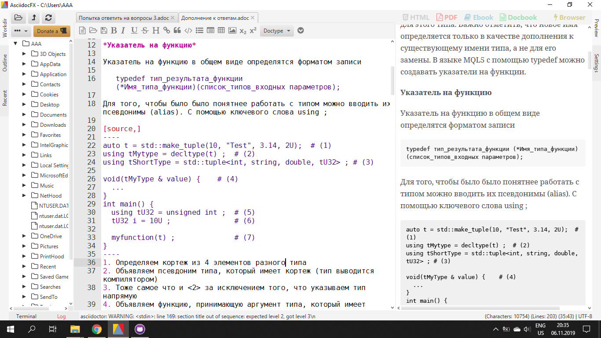
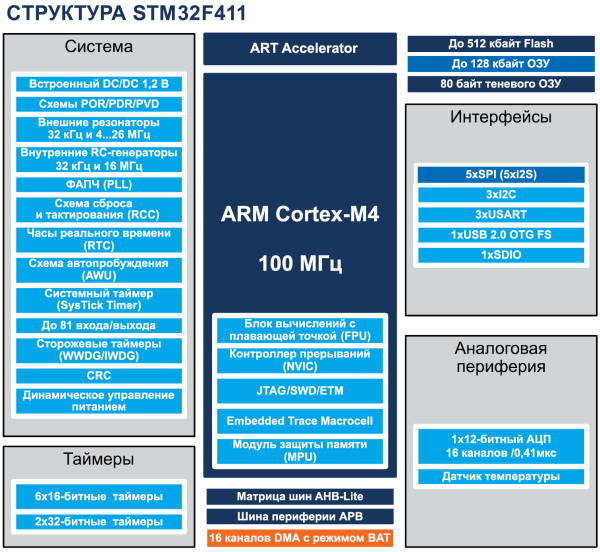

:imagesdir: Papka
== 3 попытака ответить на вопросы. Шумаков Е.М КЭ-413

==== 2.Что можно использовать, а лучше нужно вместо typedef?
[.green.background] 

ААААА!!!! Паника! Паника! Паника 
ПОМОГИТЕ!!! HELP ME!!! SOS!!!
Допоможіть,Hilfe

image::Кот.JPG[]

[.yellow.background]

Я не знаю какой тут ответ

[.red.backgorund] 

У меня же было про using Вот тут:

Для того, чтобы было было понятнее работать с типом можно вводить их псевдонимы (alias). С помощью ключевого слова using ;

[source,]
----
auto t = std::make_tuple(10, "Test", 3.14, 2U);  # (1)
using tMytype = decltype(t) ;  # (2)
using tShortType = std::tuple<int, string, double, tU32> ; # (3)

void(tMyType & value) {    # (4)
  ...
}
int main() {
  using tU32 = unsigned int ;  # (5)
  tU32 i = 10U ;               # (6)

  myfunction(t) ;              # (7)
}
----
1. Определяем кортеж из 4 элементов разного типа
2. Объявляем псевдоним типа, который имеет кортеж (тип выводится компилятором)
3. Тоже самое что и <2> за исключением того, что указываем тип напрямую
4. Объявляем функцию, принимающую аргумент типа, который имеет кортеж
5. Объявляем псевдоним типа unsigned int
7. Определяем переменную типа unsigned int

[.red.backgorund]

Вот скрин этого же 

==== 33. Объясните как вызывается функция

Функция должна быть объявлена в таком порядке, чтобы компилятор мог узнать как её вызвать. Объявление функции может выглядеть следующим образом:
[source,]
----
int MyFunction(int first, char * second);
----
Все что знает об этой функции компилятор, это то, что она принимает два параметра: целое и указатель на символ. И функция должна вернуть целое значение. Этого достаточно для компилятора, чтобы понять как вызвать эту функцию.
Соглашение об вызовах включает в себя:

* Объявление функции
* Компоновка С и С++ кода
* Последовательность использования оперативных регистров и вспомогательные регистров
* Вход в функцию
* Выход из функции
* Обработка адреса возврата

*Вход в функцию*

Параметры передающие в функцию могут использовать два метода:

Через регистры

*Через стек*

Для большей эффективности параметры передаются через регистры, но их число ограничено, поэтому если регистров не хватает, то используется стек. Для передачи параметров используются оперативные регистры R0:R3

*Выход из функции*

Функция может вернуть значение. Для возврата значения используются регистры R0:R1. Если значение больше 64 бит, то в регистр R0 записывается адрес где лежат данные.

Вызывающая функция обязана очистить стек, после того, как вызываемая функция вернула значение.

При вызове подпрограмм или при переходе по вектору прерываний адрес возврата автоматически помещается в стек. Адрес возврата может быть представлен двумя или тремя байтами, что зависит от размера памяти микроконтроллера. У МК с памятью программ 128 кбайт и менее адрес возврата двухбайтный, поэтому, указатель стека декрементируется/инкрементируется на два. У тех же микроконтроллеров, которые оснащены памятью программ размером более 128 кбайт, адрес возврата трехбайтный, а декрементирование/инкрементирование SP выполняется на три. Адрес возврата извлекается из стека при выходе из прерывания по инструкции RETI, а из подпрограммы по инструкции RET.

При вызове подпрограммы или возникновении прерывания, в стек заносится адрес возврата — адрес в памяти следующей инструкции приостановленной программы и управление передается подпрограмме или подпрограмме-обработчику. При последующем вложенном или рекурсивном вызове, прерывании подпрограммы или обработчика прерывания, в стек заносится очередной адрес возврата и т. д.

При возврате из подпрограммы или обработчика прерывания, адрес возврата снимается со стека и управление передается на следующую инструкцию приостановленной (под-)программы.

==== 47. Какие блоки входят в состав микроконтроллера STM32F411? 

*Блок системы, таймеров, интерфейса, аналоговой периферии, матрица шин, шина периферии*

В блок системы входят: внешние, внутренние резонаторы, фапч, схема сброса и тактирования, часы реального времени, системный таймер, сторожевой таймер

==== 48.В чем отличие ядра CortexM4 от CortexM3?

Отличия в наборе инструкций:

Thumb/Thumb-2​ (М3) Thumb/Thumb-2, DSP, SIMD, FP​ (М4)

у М3 отстуствует аппаратный модуль работы с плавающей точкой.

