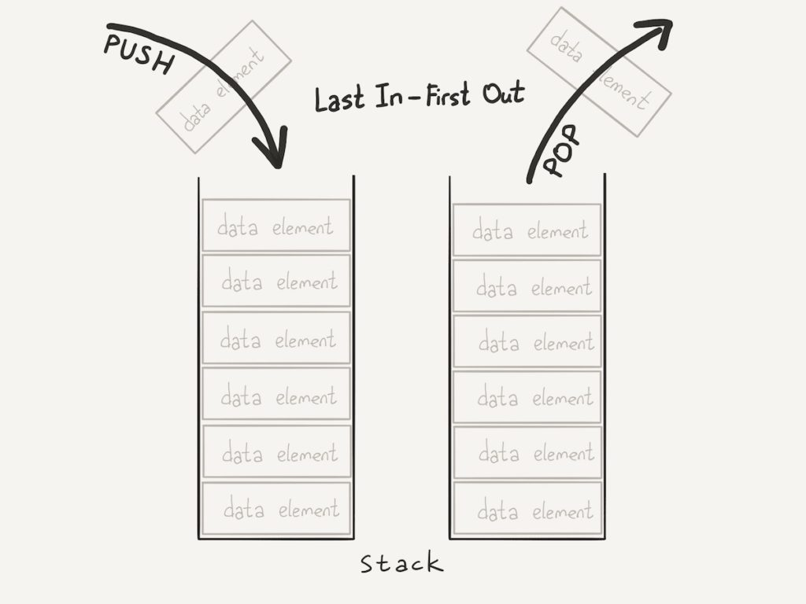

:imagesdir: Papka
== СТЕК
=== Основные термины.
Стек (stack) является структурой данных.Дисциплина работы стека обозначается LIFO, последним пришел — первым ушел (Last In First Out).Стек можно реализовать при помощи массива.

Стек поддерживает две основные операции:

* добавление элемента в вершину стека (push);
* удаление элемента из вершины стека (pop);
* Иногда встречается операция, которая получает элемент на вершине стека,но не снимает его оттуда.(Peek).

Стек можно представить себе как стопку дисков,на которую сверху можно класть диски,и брать их можно тоже только сверху.

=== Принцип работы Стека.
Стек реализуется в виде однонаправленного списка.(каждый элемент в списке содержит помимо хранимой информации в стеке указатель на следующий элемент стека).

Но также часто стек располагается в одномерном массиве с упорядоченными адресами. Такая организация стека удобна, если элемент информации занимает в памяти фиксированное количество слов. 

При этом отпадает необходимость хранения в элементе стека явного указателя на следующий элемент стека, что экономит память.

Стек заполняется методом "push". Тем самым мы помещаем каждый новый элемент в конец массива (Вершину стека).

Снимая элемент с вершины стека методом "pop" , возвращаем значение элемента,а затем удаляем этот элемент.Обращаясь к вершине стека после его заполнения, мы азворачиваем последовательность элементов.

[.red.background]
_"Стек можно применять для разворота последовательности элементов."_

== Задачи решаемые при помощи Стека.
==== 1. Грамматика правильной скобочной оследовательности.

Правильная скобочная последовательность состоит из символов – «скобок», в которой каждой отрывающейся скобке соответствует закрывающаяся скобка такого же типа,что и открывающаяся скобка. 

Решение задачи для скобочной последовательности,состоящей из скобок различного типа, удобно выполнить при помощи структуры стек:

1. При движении слева направо по строке в стек заносятся открывающиеся скобки. 
2. При добавлении в стек закрывающейся скобки проверяем наличие в вершине стека открывающейся скобки такого же типа. 
3. Если таковая скобка в вершине стека есть,то очередная скобка не добавляется, а имеющаяся в вершине удаляется.

Пример: 
[.red.background] 
Зданая последовательность скобок [([])(([]))].

Результат после обработки методом стека:

image::Пример.jpg[] 

В конце работы программы стек оказывается пустым – в этом случае скобочная последовательность правильная.

==== 2. Вычисление арифметических выражений "Обратная польская запись"
Арифметическое выражение состоит из чисел, знаков арифметических действий и скобок.

Пример: 
[.red.background]
Выражение:(7+6)/(26-13)

Существет несколько возможных видов записи данного выражения:

image::Выражение.jpg[]

Алгоритм вычисления значения арифметического выражения, записанного в постфиксной форме основан на стеке. 

При чтении выражения слева направо в вершину стека помещаются операции. Как только при чтении встречается знак арифметической операции, из стека извлекаются два последних операнда, к ним применяется текущая операция, и результат записывается обратно в вершину стека. 

По завершении работы алгоритма в стеке оказывается один элемент – значение арифметического выражения. 

